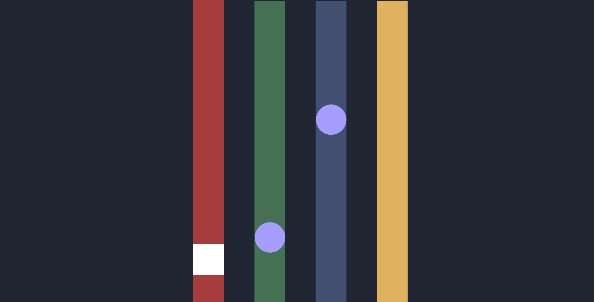
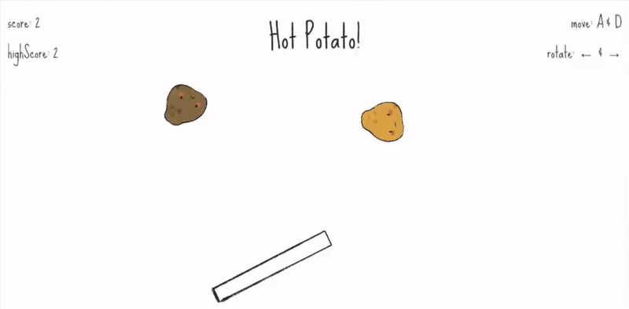
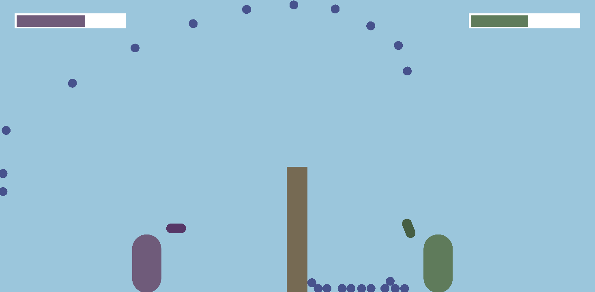
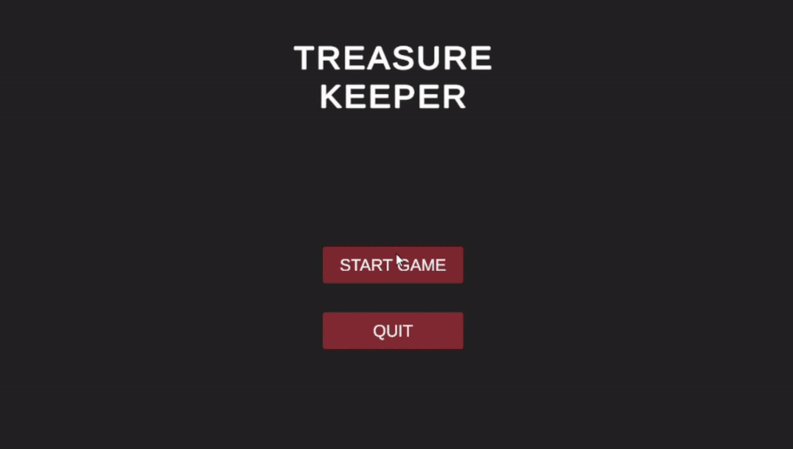
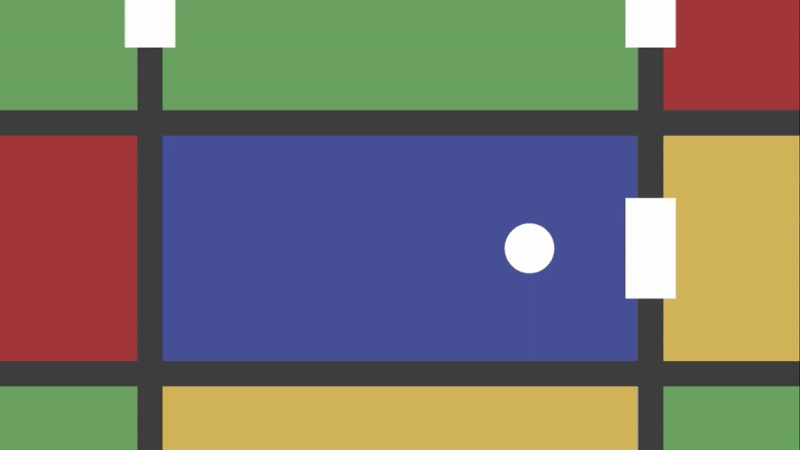
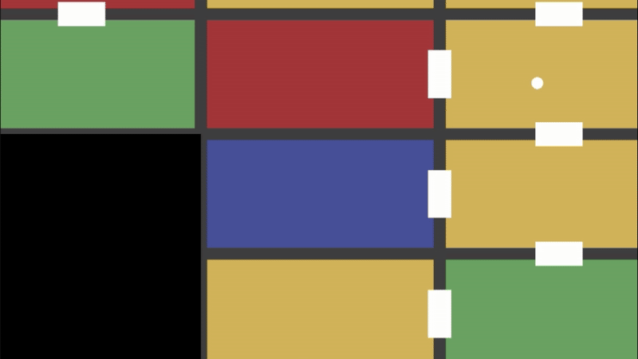
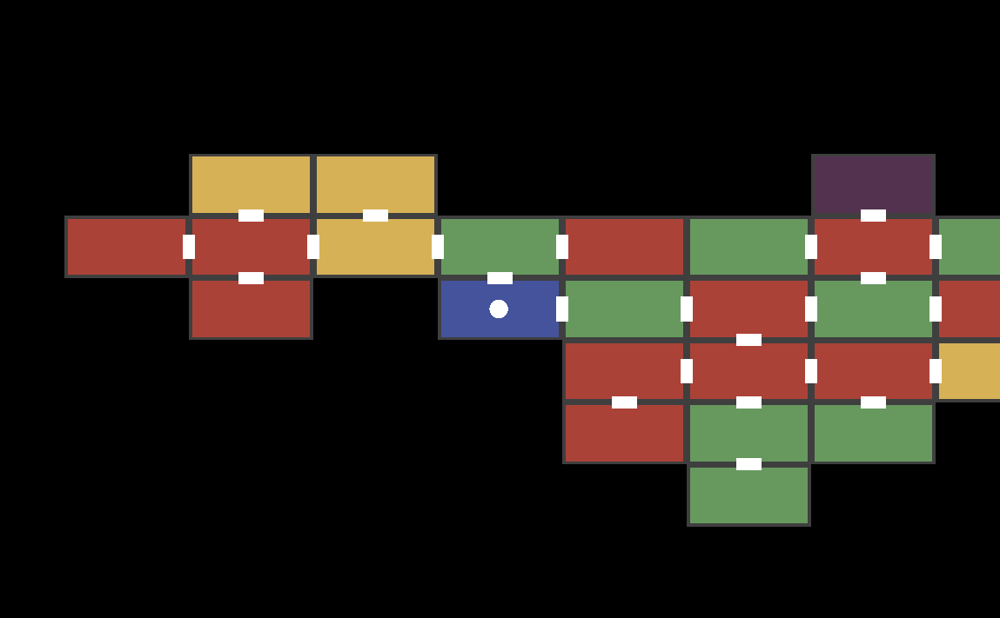
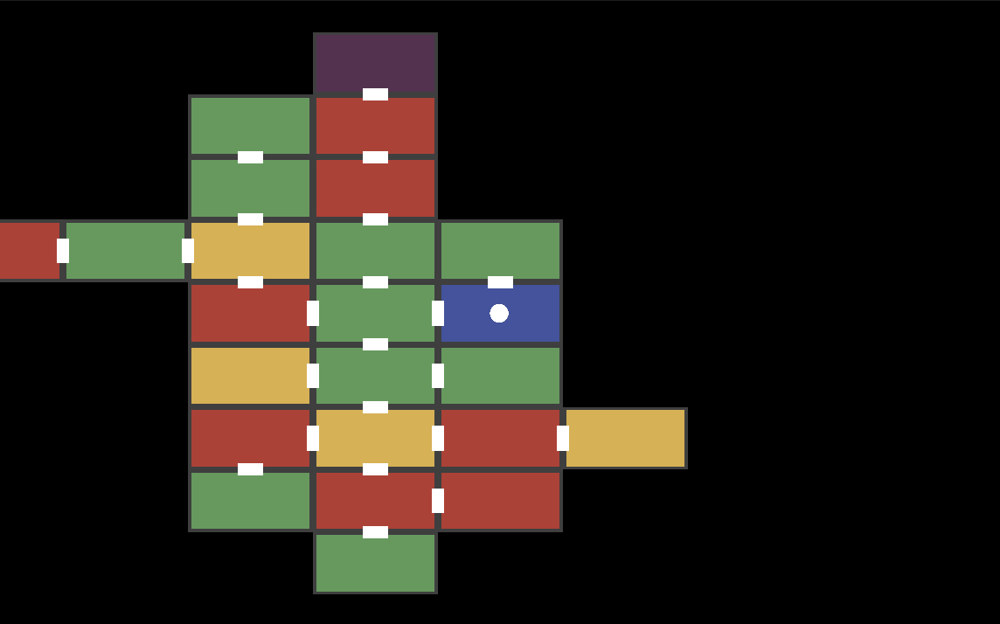
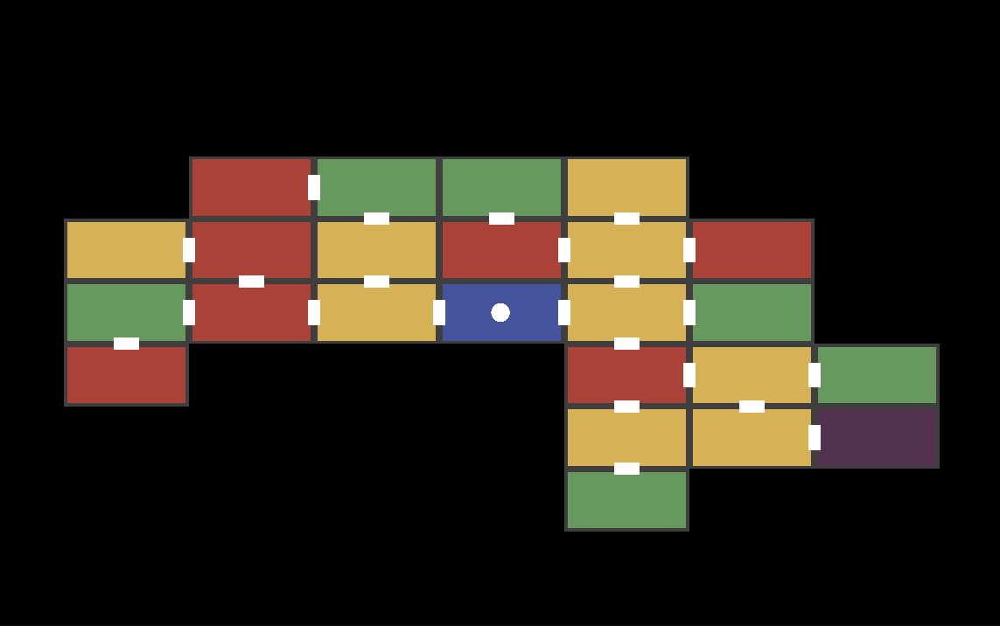

# Process Journal
## Tiny Game - 01.23.2025
### "A Trip to the Store"
One thing I knew when starting the tiny game assignment was that I couldn’t allow myself to overthink it. I knew with too many options, I would get overwhelmed. I avoided looking at examples provided and chose the first game engine I remembered being mentioned - Bitsy. Again avoiding looking at other’s creations, I started by watching a simple 5-minute tutorial and got right into it.

My initial idea was to create a memory game, where you go shopping with a list of items, and you must choose the correct ones. Choosing the wrong item could lead to… strange circumstances. I also knew I wanted to have multiple endings. My first challenge was figuring out how to incorporate a visual shopping list. With Bitsy’s limited UI and each tile being so small, I had a bit of trouble figuring this out. My solution was having the wizard (the character that gives you the initial quest to go shopping) “conjure” images of the items you need in the starting room. This allowed me to have a visual representation of the images and forced users to try to memorize each one.

Another challenge I had, less related to the game mechanics, was Bitsy’s limited color palette and tile size. While I am familiar with pixel art - and quite enjoy it - I have never attempted to make a game at this small of a resolution, with only three colors. It pushed me out of my comfort zone creatively, and I’m really happy with how it turned out.

Once I overcame these challenges, Bitsy was quite easy to use. I used their room system to set up the different levels of the store. The player must choose the right item out of many similar items to move to the next room, and if they choose wrong, they get to meet the cult that haunts the grocery store in 1 of 3 rooms, each getting creepier as the player progresses. If the player enters cult room 2, they find a note discussing their next sacrifice. With this note, if the player warns the next sacrifice, the player replaces them. If the player however chooses to ignore the sacrifice, they leave the store safe, with an eerie feeling that something is wrong.

This assignment really pushed me to stop over-thinking, over-planning, and over-analyzing the process of game-making and to simply make something. It was super cool playing all the games by my classmates, and I was especially interested in other game made with Bitsy. It was super neat seeing how they interpreted the software and how different our games were.

[A Trip to the Store](../Projects/a_trip_to_the_store.html)

## Exploration Prototype 1 - 01.27.2025
### Rhythm Game Prototype
For my first experimental prototype, I worked on the base mechanics for a rhythm game. I’d been toying with the idea for a while, and when we learned about the mechanics for the falling-asleep game last class, like the collector, dropper, and circle, I realized many of those concepts aligned with what I had in mind.

The basic idea for my game is that the player switches between different lanes using keys like ASDF. When the notes fall, the player needs to be in the correct lane and press ENTER at just the right time for it to count. I was able to get this working, but definitely not without some challenges.

The first challenge was so simple it drove me crazy for about half an hour. I needed my player box to act as a trigger so it could detect when a note collided with it. I used the function I found online, OnTriggerEnter, but no matter what I tried, my player box just wouldn’t detect the notes. After a lot of Googling and even more debug text, I finally realized my mistake: I needed to use OnTriggerEnter2D because my game is 2D. 🤦

Once that was sorted, I needed to figure out how the notes would fall. At first, I tested using gravity, but since this is a rhythm game, the movement needed to be precise to sync with the audio. I ended up calculating the velocity based on the fall duration I wanted and the distance the notes needed to travel. It worked perfectly, until I changed the fall duration to something other than 2 seconds. No matter what value I used, the notes still fell in exactly 2 seconds. That’s when I learned the hard way that you need to properly initialize your variables in the Start function.

After solving that, everything else went relatively smoothly. I learned how Unity’s event system works (super useful!), and I created a spawner that releases notes at specific times. There are still a few features I’d like to add, but they aren’t really necessary for this prototype. For example, I’d love to include proper feedback when a note is hit or missed (right now, it’s just console logs). I also think it’d be great to have the ability to chart exact note patterns, rather than having them fall into random lanes, kind of like Guitar Hero.

Overall, I’m really happy with how this turned out. I managed to build what I was hoping to build, learned a ton, and set myself up with a solid foundation to maybe keep working on this project in the future.

[In this Unity project - under Scene "1 - Experimental Protype"](../Projects/Cart%20310%20-%20Experimental%20Prototypes)

## Exploration Prototype 2 - 02.04.2025
### Hot Potato!

With this prototype, I had a few goals in mind:
- Play around with the physics concepts we learned in the last game
- Add custom sprites and sounds
- Create a simple user interface

The game I made is pretty straightforward. Hot Potato! is all about keeping as many potatoes in the air as you can, while more and more keep spawning in. Instead of using a physics material, I ended up writing custom physics in the potato script. This was because I didn’t want the potato's bounce to keep increasing uncontrollably. I’m not sure if this is the best solution, but it worked well and gave me the control I needed. I also wanted to make the platform a bit more interesting, so I added the ability to rotate it, along with the usual side-to-side movement, giving you more control over the direction the potatoes go.

As for the assets, I wanted some variation, so I created a few different-colored potatoes. I also made them react to bouncing off different objects, adding a little animation. It’s subtle, but I think it gives the potatoes a cute touch! I also downloaded a couple of royalty-free sound effects from the internet to implement. There’s one for when a potato spawns, when one falls, and every time it bounces on the platform. Additionally, I learned how to manipulate text to display the score and high score, which was a fun little challenge.

I’m starting to get pretty comfortable with the basics of the platform now. I definitely ran into fewer issues and relied on the internet a lot less this time around, which feels like progress!

[In this Unity project - under Scene "2 - Experimental Protype"](../Projects/Cart%20315%20-%20Experimental%20Prototypes)

## Exploration Prototype 3 - 02.13.2025
### Sprinkler Wars

Ok. I’m not as proud of this one as I have been of my prototypes over the past few weeks. I mean, it works, but there’s no polish, the code is full of spaghetti, and I’m ready to forget about this one and try something new next week.

The premise is simple: it’s a two-player game where resentful neighbors engage in a hose-spraying war over a fence. I wanted the water pellets to be physics-based so that players had to aim in an arc to hit their opponent. I also wanted the controls to be very simple since both players would be using the same keyboard. Each player can move back and forth, adjust their hose upwards (it lowers on its own), and shoot. I got these core mechanics working, though I’m not completely satisfied with the implementation.

That said, through all this spaghetti, I did learn a lot about shooting projectiles, thanks to [this](https://youtu.be/zYN1LTMdFYg?si=dDOiGjsx3OSctZVt) youtube video. I think I’ll give these projectiles another shot in my next prototype. My biggest struggles with this project came from not fully understanding how different scripts communicate with each other, which gave me lots of headaches, time I could have spent making this game… actually fun.

And I do think there’s potential here! I just might need to dig it up from the roots and start again.

[In this Unity project - under Scene "3 - Experimental Protype"](../Projects/Cart%20315%20-%20Experimental%20Prototypes)

## Exploration Prototype 4 - 02.20.2025
### Treasure Keeper

Building off the mess of sprinkler wars, I still wanted to make a game with a shooting mechanic, but one that actually felt complete (in its limited scope) and well, fun. I had the idea of making a top down game kinda like Journey of the Prairie King, the mini-game inside Stardew Valley (I apologize it there are more classic examples of this kind of game) where enemies spawn in on all sides but instead of waves you just have to survive as long as possible. Also in this game surviving just means keeping the enemies grubby hands off your treasure for as long as possible.

Basically I knew I needed/wanted the following mechanics:

Needs:
- Player movement and gun shooting mechanics
  - Thank you again to [this](https://youtu.be/zYN1LTMdFYg?si=dDOiGjsx3OSctZVt) youtube video!
- Simple enemy AI
- Treasure that takes damage while enemies are touching it
- A health bar for the treasure
  - Thanks to [this](https://youtu.be/lYZayXViTN8?si=yzutEf_o5F2evggJ) short video

Wants:
- Particle effects ~~~
  - Thanks again mr sasquatch for [this](https://youtu.be/0HKSvT2gcuk?si=Hi4hPBCNi61zqG-f) video
- Score system
- Finally implement a dreaded menu screen
- Power ups (didn't get to this one… maybe one day)

I will say, even though this one feels much more polished than the last… I’m still not super proud of some of my coding choices that I made for time purposes. I figure that my knowledge of why these decisions are bad + the fact that I would do it differently if I was going further than a prototype has to count for something… right?

Some of the changes I would make to the code implementation if I was going forward would be:
- **Health bar implementation**: it sucked last time and it's not great this time, Im handling the health in both the treasure script and sperately in the health bar script, and the health in the health bar is based on its width just happening to be perfectly 100. If I wanted to change the size of the health bar I would be screwed unless I changed the code.
- **Implementing different behaviours in odd scripts**: for example I implemented the entire scoring mechanic within the enemy script simply because I was lazy and I knew it would be easy to increment the score everytime the an enemy died. I had to do a few workarounds to even make this work but it probably would've been more worth it to just do it right

I am probably forgetting some too… but I’m really just writing it as a reminder to myself to practice best practices and stop being lazy lol.
Anyways, I’m happy with this game overall and I genuinely think its kinda fun :)

[In this Unity project - under Scene "4 - Experimental Protype", or "TK Menu Screen"](../Projects/Cart%20315%20-%20Experimental%20Prototypes)

## Iterative Prototype 1 - 03.03.2025
### Untitled Roguelike - Dungeon Generation

I cant lie, the pressure to come up with an idea that I would be working on for the rest of the semester got to me, but I ended up settling on a Roguelike! I am really interested in procedurally generated worlds so I thought I’d dip my toes in it with a little dungeon generation.

My overall idea for the game is that the player is a museum owner during the apocalypse and must go out into the dangerous world to uncover ~ lost relics of a forgotten past ~. I was thinking the game play loop would be pretty similar to Moonlighter, where you go dungeon crawling at night and shopkeep (museum keep?) during the day. However for my scope for this class, I am thinking I will be mostly sticking to just the dungeon.

For my first iteration I wanted to jump right in to the map generation, and even though I went pretty simple with a grid based system, it was still much more complicated than I hoped. I started with a Room class, and created room type child classes (Entry, Easy, Medium, Hard, Exit) that are a bit redundant at the moment but I think having the separate classes will come in handy later. I also have a Door class that teleports the player between rooms (... see below for me having trouble with this mechanic, and my fixed version)

I created a generator using a breadth-first generation algorithm using a queue so that the rooms would generate in all directions. It starts with an entry room and begins creating new adjacent rooms given a random number of doors. When generating the amount of doors each room had I also had to take into account how many rooms were left so I didnt accidentally create doors that led to nowhere.

I also didn't want to have the entry room go directly into a hard room, so I made sure that each room could only go up 1 difficulty from the previous room so it gets harder the further you go form the entrance.

Ideas for the future ~
- Infinite Dungeon: After reaching the purple exit room, you advance to a new level with difficulty increased
- Combat system
- Different types of enemies
- Inventory system and treasure
- Big relic room at the end of each floor where you have to protect your excavator while enemies swarm (can reuse a lot from treasure keeper here heheh)
- Fine-tune the dungeon generation: maybe limit hard rooms or change probabilities

Enjoy some of my generated maps :)

Legend ~
- Blue: Entry
- Green: Easy Difficulty
- Yellow: Medium Difficulty
- Red: Hard Difficulty
- Purple: Exit

